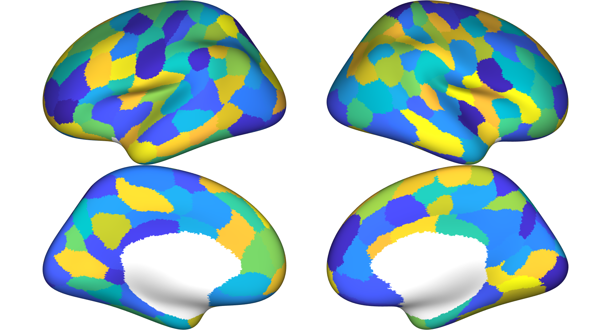

# multiAtlasTT (Beta)
_Multi-Atlas Transfer Tools for Neuroimaging (maTT)_

Given a completed FreeSurfer _recon-all_ directory, these scripts can transfer an atlas (.annot file; also called a 'parcellation') in fsaverage space to _**subject space**_, in both volume (nifti) and surface (.annot) format. Therefore, using these tools one can obtain multiple parcellations in the subject space5 (in addition to the Desikan-Killiany and Destrieux parcellations that recon-all usually constructs1). The major part of the label transfer script was adapted from scripts written by the [CJNeuroLab](https://cjneurolab.org/2016/11/22/hcp-mmp1-0-volumetric-nifti-masks-in-native-structural-space/). The goal of these tools is to make fitting multiple atlases a piece of cake. Have fun! 

This project is in *beta*; work is ongoing. Please feel free to comment via issue/pull request.

#### maTT2 update (_recommended_)
We have now added functionality to use FreeSurfer [Gaussian classifier surface atlas](https://surfer.nmr.mgh.harvard.edu/fswiki/SurfaceLabelAtlas) (.gcs) files to label individual subjects. These files are large, so they are hosted in a Figshare repository here: https://doi.org/10.6084/m9.figshare.5998583.

The gcs files were created by running the Mindboggle 101 brains (http://dx.doi.org/10.7910/DVN/HMQKCK) through FreeSurfer _recon-all_ (versions 5.3, 6.0, and 7.1) and creating individually labeled atlases using the maTT functionality. For each atlas, we created a Gaussian classifer surface atlas using the 101 Mindboggle subjects. We have provided an example script for this creation process (``maTT2_caLabelTrain_example.sh``). We have also trained Gaussian classifier surface atlases using the HCP unrelated 100 subjects; these can be found here: https://doi.org/10.6084/m9.figshare.7552853. 

An advantage of using the maTT2 functionality is that it takes much less time. Additionally, the maTT2-derived atlases seem to contain smoother borders between parcellated regions. 

## Prerequisites

* [FSL](https://fsl.fmrib.ox.ac.uk/fsl/fslwiki)
* [FreeSurfer](https://surfer.nmr.mgh.harvard.edu/fswiki)
* [easy_lausanne](https://github.com/mattcieslak/easy_lausanne) (optional, but good to have)
  * Also, easy_lausanne is a great tool that you should check out!
* python3 with [nibabel](https://nipy.org/nibabel/). If you need to point to a specific python executable (as might be case on shared grid computing), you can `export py_bin=/your/path/to/python` in the bash script.
* Unix environment to run scripts on (developed on Ubuntu 16.04)

## Usage

See ``example_run_maTT.sh`` for modifiable example scipt to run maTT. 

See ``example_run_maTT2.sh`` for modifiable example script to run maTT2, which uses gcs files that need to be downloaded from the accompanying [figshare repository](https://doi.org/10.6084/m9.figshare.5998583). 

## What do these scripts output?

After program completion, the resultant file of interest will be called ``${atlas}/${atlas}_rmap.nii.gz`` (rmap stands for re-mapped) which will contain the atlas labels 1:(num labels). 14 Subcortical labels will be added at the end. There will be a filed called ``${atlas}/${atlas}_rmap.nii.gz_remap.txt`` which described how the original label numbers from the FreeSurfer annotation4 were mapped to this rmap nifti file. 

The LUT (look up table) files will let you know the names of the cortical labels (but remember the extra 14 at the end, which correspond to [these regions](./atlas_data/LUT_subcort.txt) which are extracted from the FreeSurfer segmentation). For example, see the LUT for the Schaefer100 [here](./atlas_data/schaefer100-yeo17/LUT_schaefer100-yeo17.txt) or for the hcp-mmp [here](./atlas_data/hcp-mmp-b/LUT_hcp-mmp-b.txt). Please pay attention to the regions labeled stuff like `*unknown*` or `*???*` in the LUT. These regions will likely be in your ``${atlas}/${atlas}_rmap.nii.gz`` ... but you probably want to ignore them for analysis. 

Sometimes, parcellation regions on the surface atlas might be so small, that they don't render in the output volume. In this case, the indices of the outputs will still correspond to the LUT (in other words, the indices should not be shifted!). Be aware that this could happen and adjust downstream analysis code accordingly please. 

Overall, please carefully check the output of these tools to make sure that there aren't any data discrepancies and that you can correctly identify which label is which. These tools are provided for your convenience, but the quality of their output cannot be guaranteed. Please also note that the method for fitting these parcellations uses information from FreeSurfer's surface warp; however, some of these parcellations were originally fit via different means. Please do consider how this could affect your downstream analysis. 

## Data Sources

_Note: for all atlases, only cortical areas are fit with the surface warp. The additional 14 subcortical areas are from FreeSurfer's segmentation_

* [aicha](https://www.gin.cnrs.fr/en/tools/aicha/) (344 cortical nodes + 14 subcort nodes)
  * > Joliot, M., Jobard, G., Naveau, M., Delcroix, N., Petit, L., Zago, L., ... & Tzourio-Mazoyer, N. (2015). AICHA: An atlas of intrinsic connectivity of homotopic areas. Journal of neuroscience methods, 254, 46-59.
  * The original volmetric atlas in MNI space was projected for fsaverage using the CBIG lab's [registration fusion](https://github.com/ThomasYeoLab/CBIG/tree/master/stable_projects/registration/Wu2017_RegistrationFusion)
  * This is not the complete aicha atlas, as it is missing subcortical areas defined by that atlas. The subcort here are from FreeSurfer (as is the case with all these parcellations). 
 
* [baldassano](https://www.dpmlab.org/pubs.html) (170 + 14 subcort nodes)
  * > Baldassano, C., Beck, D. M., & Fei-Fei, L. (2015). Parcellating connectivity in spatial maps. PeerJ, 3, e784.
  * Gii files were downloaded from the author's [website](https://www.dpmlab.org/pubs.html) and transferred to fsaverage space. Parcellations in the right hemisphere were accidentally named 'LH_region*'. 

* [gordon333dil](https://mail.nmr.mgh.harvard.edu/pipermail//freesurfer/2017-April/051470.html) (333 nodes + 14 subcort nodes)
  * > Gordon, E. M., Laumann, T. O., Adeyemo, B., Huckins, J. F., Kelley, W. M., & Petersen, S. E. (2014). Generation and evaluation of a cortical area parcellation from resting-state correlations. Cerebral cortex, 26(1), 288-303.
Chicago	
  * gordon333dil is a version of the gordon atlas without gaps between the labels; was created by using the [dilateParcellation](https://github.com/faskowit/dilateParcellation) tool.
  
* [hcp-mmp](https://figshare.com/articles/HCP-MMP1_0_projected_on_fsaverage/3498446) & hcp-mmp-b (360 nodes + 14 subcort nodes)
  * > Glasser, M. F., Coalson, T. S., Robinson, E. C., Hacker, C. D., Harwell, J., Yacoub, E., ... & Smith, S. M. (2016). A multi-modal parcellation of human cerebral cortex. Nature, 536(7615), 171-178.
  * 2
  * hcp-mmp-b is a version of the HCP-MMP1.0 atlas converted from the [BALSA database](https://balsa.wustl.edu/study/show/RVVG)
  (file: Q1-Q6_RelatedValidation210.CorticalAreas_dil_Final_Final_Areas_Group_Colors.32k_fs_LR.dlabel.nii) using the [fsLR_2_fsaverage_4_labels](https://github.com/faskowit/fsLR_2_fsaverage_4_labels) tool. This tool follows the recommendations found [here](https://wiki.humanconnectome.org/display/PublicData/HCP+Users+FAQ#HCPUsersFAQ-9.HowdoImapdatabetweenFreeSurferandHCP?) using the [8may2017](http://brainvis.wustl.edu/workbench/standard_mesh_atlases_8may2017.zip) data. _Note_: this hcp-mmp-b atlas does not have '???' regions for the left and right hemis, wheresas the hcp-mmp atlas does. This affects the final node label indices in the rmap files. Also, the color LUT of the hcp-mmp-b is slightly different.
 
* [nspn500](https://github.com/KirstieJane/NSPN_WhitakerVertes_PNAS2016/tree/master/FS_SUBJECTS/fsaverageSubP) (308 nodes + 14 subcort nodes)
  * > Whitaker, K. J., Vértes, P. E., Romero-Garcia, R., Váša, F., Moutoussis, M., Prabhu, G., ... & Tait, R. (2016). Adolescence is associated with genomically patterned consolidation of the hubs of the human brain connectome. Proceedings of the National Academy of Sciences, 113(32), 9105-9110.
  * > Romero-Garcia, R., Atienza, M., Clemmensen, L. H., & Cantero, J. L. (2012). Effects of network resolution on topological properties of human neocortex. Neuroimage, 59(4), 3522-3532.

* [schaefer*-yeo17](https://github.com/ThomasYeoLab/CBIG/tree/master/stable_projects/brain_parcellation/Schaefer2018_LocalGlobal) (100, 200, 300, 400, 500 + 14 subcort nodes)
  * > Schaefer, A., Kong, R., Gordon, E. M., Laumann, T. O., Zuo, X. N., Holmes, A. J., ... & Yeo, B. T. (2017). Local-global parcellation of the human cerebral cortex from intrinsic functional connectivity mri. Cerebral Cortex, 1-20.
  
* [shen268](https://www.nitrc.org/frs/?group_id=51) (235 nodes + 14 subcort)
  * > Finn, E. S., Shen, X., Scheinost, D., Rosenberg, M. D., Huang, J., Chun, M. M., ... & Constable, R. T. (2015). Functional connectome fingerprinting: identifying individuals using patterns of brain connectivity. Nature neuroscience, 18(11), 1664-1671.
  * > Shen, X., Papademetris, X., & Constable, R. T. (2010). Graph-theory based parcellation of functional subunits in the brain from resting-state fMRI data. Neuroimage, 50(3), 1027-1035.
  * The original volmetric atlas in MNI space was projected for fsaverage using the CBIG's lab's [registration fusion](https://github.com/ThomasYeoLab/CBIG/tree/master/stable_projects/registration/Wu2017_RegistrationFusion). This is why there are not 268 nodes, as in the original MNI atlas.

  
* [yeo17dil](https://github.com/ThomasYeoLab/CBIG/tree/master/stable_projects/brain_parcellation/Yeo2011_fcMRI_clustering) (114 nodes + 14 subcort nodes)
  * > Yeo BT, Krienen FM, Sepulcre J, Sabuncu MR, Lashkari D, Hollinshead M, Roffman JL, Smoller JW, Zollei L., Polimeni JR, Fischl B, Liu H, Buckner RL. The organization of the human cerebral cortex estimated by intrinsic functional connectivity. Journal of Neurophysiology 106(3):1125-1165, 2011.
  * > Krienen FM, Yeo BTT, Buckner RL. Reconfigurable state-dependent functional coupling modes cluster around a core functional architecture. Philosophical Transactions of the Royal Society B, 369:20130526, 2014.
  * > Yeo BTT, Tandi J, Chee MWL. Functional connectivity during rested wakefulness predicts vulnerability to sleep deprivation. Neuroimage 111:147-158, 2015.
  * > Zuo, X.N., et al. An open science resource for establishing reliability and reproducibility in functional connectomics, Sci data, 1:140049, 2014.
  * yeo17dil is a version of the yeo17 split-label atlas without gaps between the labels; was created by using the [dilateParcellation](https://github.com/faskowit/dilateParcellation) tool
  * 3
  
* Added data from [Arslan et. al 2017 Box](https://imperialcollegelondon.app.box.com/s/g5q0kyvpqdha5jgofhmiov9ws1ao0hi0/)  (*note: experimental*) 
  * We transformed the Arslan data, which is fs_LR 32k space, to fsaverage space, and then made .annot files in this space. For these data, we created arbitrary parcel names and LUT files. The LUT files here seem to have some weirdness in them regarding hemisphere assignments. Thus, these atlases are provided as a means to slice up the cortex. The names and correspondences of the LUT should be determined independently; *not* based on the LUT files provided here. 
  * aal (82 + 14 subcort nodes)
    * > Rolls, E. T., Joliot, M., & Tzourio-Mazoyer, N. (2015). Implementation of a new parcellation of the orbitofrontal cortex in the automated anatomical labeling atlas. Neuroimage, 122, 1-5.
  * arslan (50 + 14 subcort nodes)
    * > Arslan, S., & Rueckert, D. (2015, October). Multi-level parcellation of the cerebral cortex using resting-state fMRI. In International Conference on Medical Image Computing and Computer-Assisted Intervention (pp. 47-54). Springer, Cham.
  * ica (168 + 14 subcort nodes)
    * > Beckmann, C. F., & Smith, S. M. (2004). Probabilistic independent component analysis for functional magnetic resonance imaging. IEEE transactions on medical imaging, 23(2), 137-152.
  * power (130 + 14 subcort nodes)
    * > Power, J. D., Cohen, A. L., Nelson, S. M., Wig, G. S., Barnes, K. A., Church, J. A., ... & Petersen, S. E. (2011). Functional network organization of the human brain. Neuron, 72(4), 665-678.

## Notes / FAQ

* Useful reading for considering what parcellation to use:
  > Zalesky, A., Fornito, A., Harding, I. H., Cocchi, L., Yücel, M., Pantelis, C., & Bullmore, E. T. (2010). Whole-brain anatomical networks: does the choice of nodes matter?. Neuroimage, 50(3), 970-983.
  
  > de Reus, M. A., & Van den Heuvel, M. P. (2013). The parcellation-based connectome: limitations and extensions. Neuroimage, 80, 397-404.
  
  > Arslan, S., Ktena, S. I., Makropoulos, A., Robinson, E. C., Rueckert, D., & Parisot, S. (2017). Human brain mapping: a systematic comparison of parcellation methods for the human cerebral cortex. NeuroImage.
  
  > Messé, A. (2020). Parcellation influence on the connectivity‐based structure–function relationship in the human brain. Human Brain Mapping, 41(5), 1167-1180.

* The atlases here are not a comprehensive set of the parcellations used in neuroimaging. If you would like to see another parcellation (in fsaverage space) supported here, feel free to post an issue/pull request! 

* Fitting a parcellation in the manner used here is not the only method for fitting parcellations to neuroimage data. While these tools warp an 'average' brain to each subject, some methods compute individualized parcellations based on subject-level data. 

* The gcs label training script uses surfaces fit with the original maTT functionality, to produce the maTT2 files. These surface annotations were not manually edited, like what was done for the [Mindboggle-101](https://mindboggle.info/data.html).  

* _How are these methods different than using a parcellation in a standard volume space (say, MNI)?_ Using these tools, you'll recover a parcellation in the T1w space. This parcellation will use FreeSurfer's surface-based functions to render this parcellation in this space. As a result, you'll get a parcellation that follows the individual's cortical ribbon (assuming it was segmented well with FreeSurfer). Therefore, you can use the output atlases to measure parcellation-based info in the native space, avoiding a non-linear warp of the info to a common space. 

Checkout the [Brainlife.io](https://brainlife.io/) version of this tool [here](https://github.com/faskowit/app-multiAtlasTT).

### Footnotes

1 The maTT tools transfer the atlas from fsaverage to subject space using [_mri_label2label_](https://surfer.nmr.mgh.harvard.edu/fswiki/mri_label2label), whereas FreeSufer _recon-all_ uses _mris_ca_label_ to generative the Desikan and Destrieux parcellations in native space. This tool can be used as part of a pipeline to generate the appropriate .gcs files necessary for potentially using the _mris_ca_train_ and _mris_ca_label_ functions. In fact, this is what we did to make the .gcs files for the maTT2 functionality.

2 The creators of the HCP-MMP1.0 atlas [do not fully support](https://www.mail-archive.com/hcp-users@humanconnectome.org/msg03072.html) transferring their parcellation to volume space. This is because the HCP altas is supposed to be fit with multiple imaging modalities, multi-modal surface matching, and a perceptron; on a high resolution surface. These tools only utilize the FreeSurfer surface registration. Therefore, proceed at your own risk. See also [this preprint](https://www.biorxiv.org/content/early/2018/01/29/255620) for additional info on the HCP viewpoint.

3 The yeo17 atlas used here is the subdivided 17 atlas, which contains 57 nodes per hemisphere. This atlas was originally in fsaverage5 space, but we have upsampled it to fsaverage space. Note that gaps exist between atlas regions; these gaps are labeled as intensities 1 and 59 for the left and right hemisphere respectively. 

4 Note that the FreeSurfer annotation adds 1000 to values of the left hemisphere and 2000 to values of the right hemisphere. In the output folder, there will also be a non-rmap'ed file saved, for reference.

5 The subject space referred to here is the space that the T1w image was in when submitted to the _recon-all_ script. 

 This material is based upon work supported by the National Science Foundation Graduate Research Fellowship under Grant No. 1342962. Any opinion, findings, and conclusions or recommendations expressed in this material are those of the authors(s) and do not necessarily reflect the views of the National Science Foundation. 
